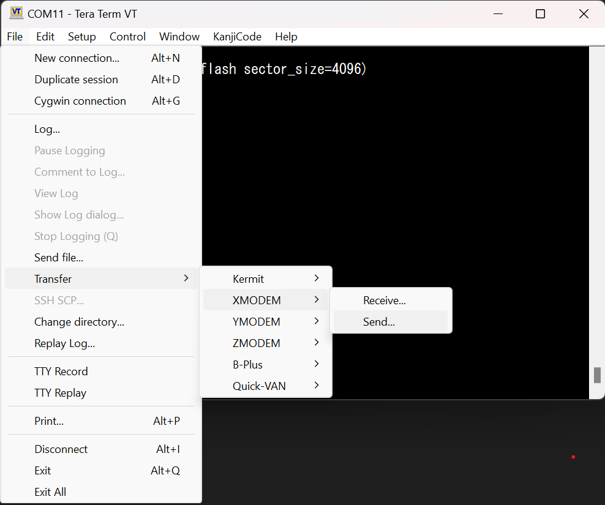
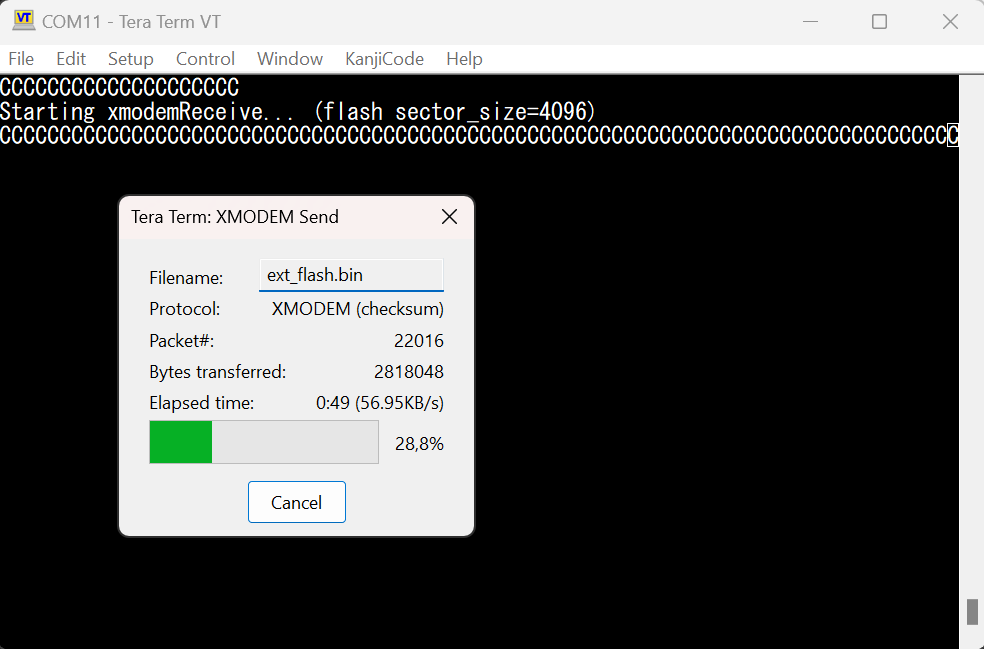
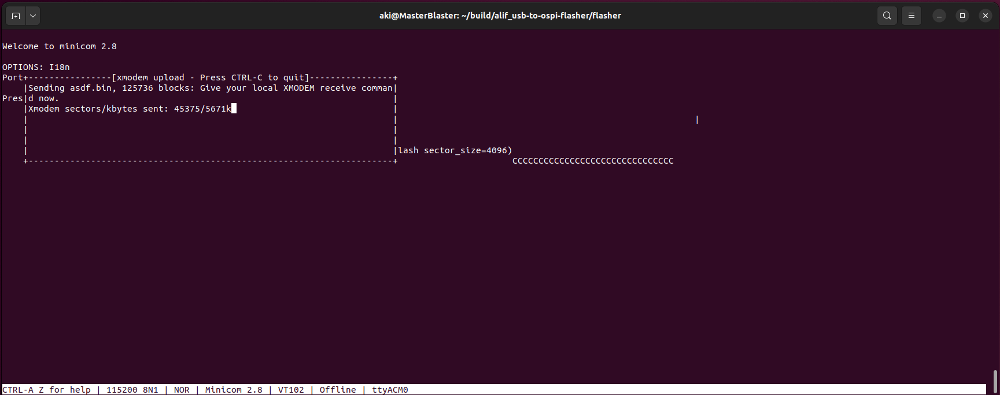

# Programming OSPI flash over USB serial connection
- Application receives data using XMODEM protocol and writes it to the external OSPI flash

- You can use this example to program ML model to OSPI flash
- This application is built on VSCode Getting Started Template (alif_vscode-template)
- The default hardware is Gen 2 Ensemble DevKit
- Tested to work with [Tera Term](https://teratermproject.github.io/index-en.html) but there are plenty of other XMODEM applications which should work as well.
Please follow the template project's [Getting started guide](https://github.com/alifsemi/alif_vscode-template/blob/main/doc/getting_started.md) to set up the environment.

## Brief description
The application initializes USBX and opens CDC ACM serial connection.
- Two thread solution: One thread handles the XMODEM communication and sends the ready to program packets to programmer thread over message queue.
- Data is received using XMODEM protocol
- When one full sector of data (4KiB) is received the flash sector is erased and pages are programmed
- Last sector is detected from the end of transmission
- Programming target address starts from the beginning of the OSPI flash address space
- printf is retargeted to UART4
- Note/TODO: existing data in the end of last written sector is not preserved.
- XMODEM-1K is not yet supported, but it is the flash device limiting the speed anyway

## Quick start
- Build the application using VS Code 
  - (Press F1, type "Run", click "Tasks: Run Task") First Time Pack Installation
  - Click the hammer icon in the csolution extension
  - (Press F1, type "Run", click "Tasks: Run Task") Program with Security Toolkit

- Program the OSPI flash using your favorite terminal emulator
  - Starting the transfer with Tera Term
    
  
  - Ongoing transfer
    

  - In Linux you can use for example minicom
  ```
  minicom -D /dev/ttyACMX
  ```
  - In minicom press CTRL-A and then press S and choose xmodem...
  
